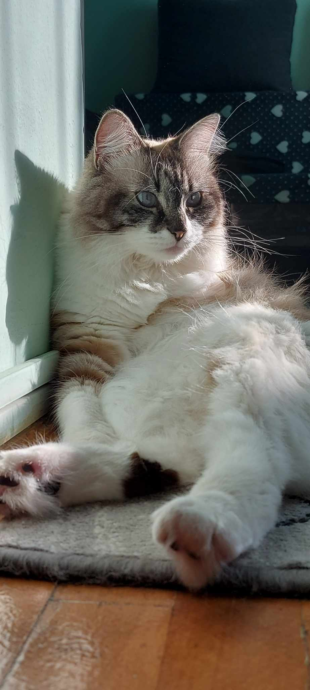

# About

This project aims to provide a solution for people who keep losing their cats (yes, I do keep losing mine in the apartment, and most of the time I spend like 5 minutes at a time searching for her).

This is a basic multithreaded application that can work with an infinite amount of theoretical cameras (capped by hardware restrictions). It uses the YOLO model for object (cat) detection and a basic motion sensor that compares two frames.

# Current Progress

## Implemented
    * Cat detection using YOLO
    * Motion sensor
    * Multithreaded for each camera
    * Easy to expand config file

## Planned for later
    * DB that would keep the latest 30 positions of the cat
    * Android/Web interface
    * Deployment with Docker of the application

# Project Structure

## Subfolders

    - cat_detector: cat detector YOLO model
    - cat_folder: location for saving the cat location that has been detected
    - core: core folder for setting & database configuration
    - helper: helper functions
    - motion_sensor: motion sensor algorithm

# The cat that I keep losing

She is the reason I started this project. Isn't she cute?

# Requirements

To be able to run this project you need to have Python 3.10+ and a GPU.

# Setup

1. Download the repository: `git clone https://github.com/LCCosmin/CatFinder.git`
2. Create a new environment: `python3 -m venv <name_of_the_virtualenv>`
3. Activate the environment: `source <name_of_the_virtualenv>/bin/activate`
4. Install requirements.txt: `pip install -r requirements.txt`
5. Make adjustments in config.yaml based on what you want to do.
6. Run main.py: `python3 main.py`